# README

## 프로젝트 이름 및 설명

---

### **프리토킹**을 위한 자유로운 대화가 가능한 랜덤 화상채팅

## 팀원 소개

---

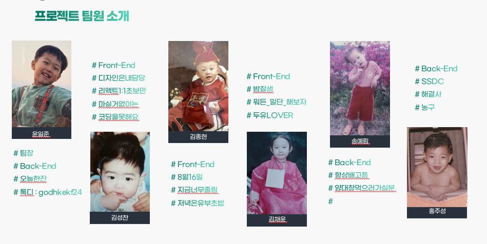

## 프로젝트 정보

---

### 기획의도

- 언제 어디에서나 가볍게 언어교환을 할 수 있는 공간이 있으면 좋겠다.
- 외국인 울렁증 고치고 싶다!
- 내 생각을 외국어로 바로바로 전달하고 싶다!

⇒ 그런 환경을 우리가 만들어보자!

### 이런 포맷은 많은 편, 근데 차별점은?

- 매칭까지는 우리가 해준다, 다만 대화는 너희가 알아서 해라!
    - 실전 경험이 처음인 사람들을 위한 유익한 기능을 제공해주면 좋겠다
    - 아이스브레이킹을 위해 주제를 던진다거나… (최근 뉴스, 오픽, 토스 단골 질문)
- 첫 취지는 실전 경험 및 공부를 위한 목적
    - 문란한 소재들을 제거해보자
    - 신고 기능 구현
    

## 기술스택 및 개발환경

---

### 프론트엔드

- React : 18.2.0
- Redux : 8.0.2
- CSS Module

### 백엔드

- Spring boot : 2.4.5
- Spring Data Jpa : 2.4.5
- Spring Security : 2.4.5
- Spring Oauth2 : 2.4.5
- Lombok : 1.18.20

### WebRTC

- kurento media server : 6.16.0
- coturn-openvidu: 2.22.0

### OS

- Windows 10

### IDE

- Visual Studio Code : 1.70
- IntelliJ IDEA Ultimate : 2022.2

### DB

- MySQL : 8.0.30
- Redis : 7.0.4

### Server

- Ubuntu 20.04

## 프로젝트 산출물

---

### ERD

### 와이어프레임 & 프로토타이핑

[https://www.figma.com/file/OqoGzyfLCQ1rtuvCJvuIwr/HelloWorld?node-id=0%3A1](https://www.figma.com/file/OqoGzyfLCQ1rtuvCJvuIwr/HelloWorld?node-id=0%3A1)

## 주요 기능

---

### 1:1 화상채팅

- 랜덤으로 매칭, 5분이 지나면 로테이션
- 선행 규칙
    - 두 유저 가운데, 룸을 생성하는 사람을 룸 생성자라고 규정
    - 두 유저 가운데, 존재하는 룸에 참여하는 사람을 룸 입장자라고 규정
    - 룸에 유저가 적합한지 분류할 수 있는 기준 필요
        - ex: 영어, 중국어, 일본어 등
    - 룸 데이터와 socket 인스턴스는 별도로 관리
        - ex: Redux와 같은 상태관리 라이브러리
- 로직 구현 순서
    
    
    

### VIP

- 대화 시간을 연장할 수 있음
- 대화에 필요한 주제를 랜덤으로 제공

### 하트

- 대화 후 상대방에게 하트를 건넬 수 있음
- 하트 5개를 사용해 시간 연장이 가능

### 그 외

- 신고 기능
- 공지사항, 대화에 도움이 될 만한 팁 등을 설명하는 포스트를 메인 화면에서 제공

## 결과 예시 화면 및 UCC 링크 {- 유튭 스크린샷 / GIF 넣기 / 유툽링크}

---

### 유튜브링크

[https://www.youtube.com/watch?v=8ZY0X5w0Hig](https://www.youtube.com/watch?v=8ZY0X5w0Hig)

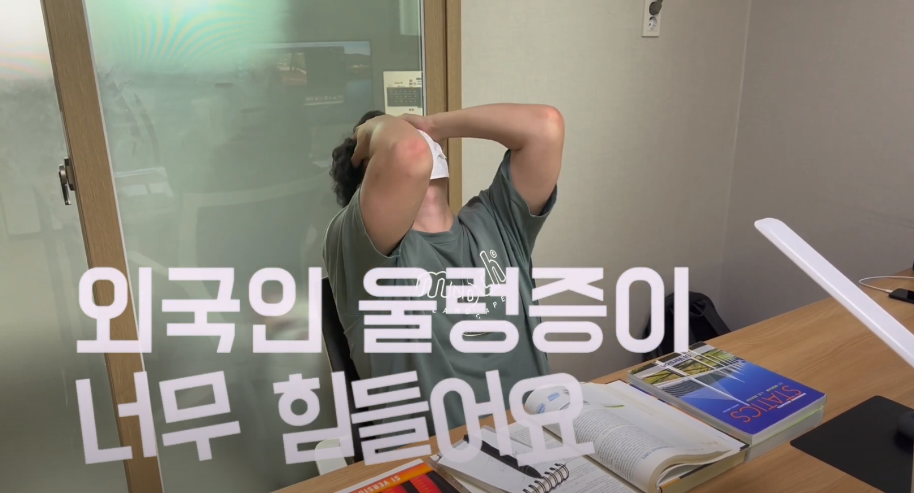

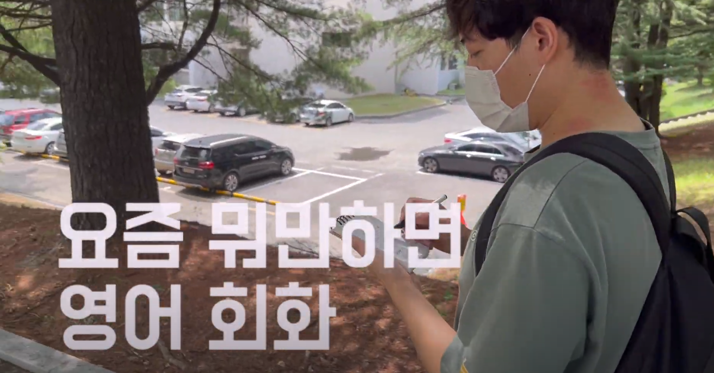

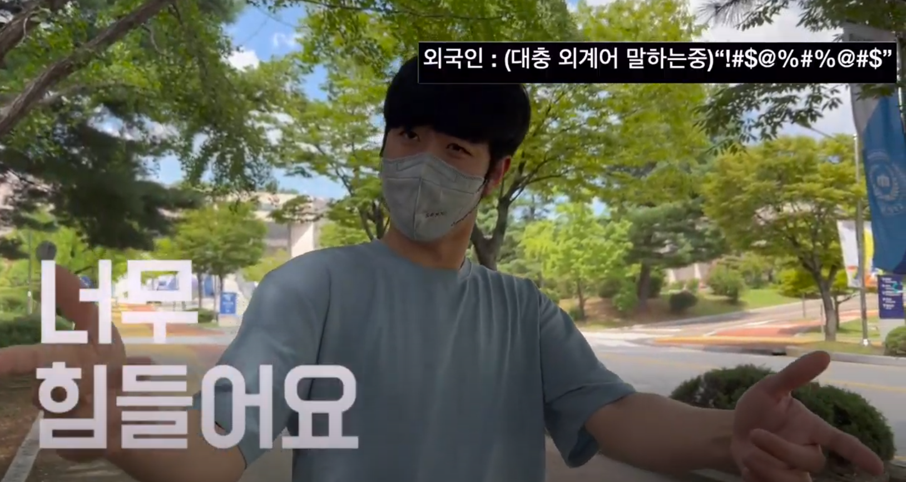

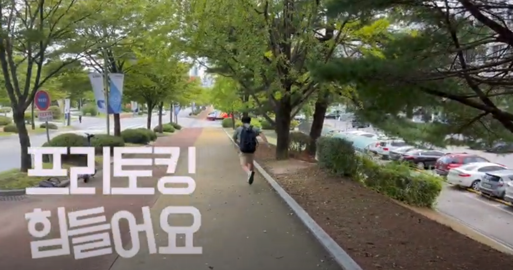

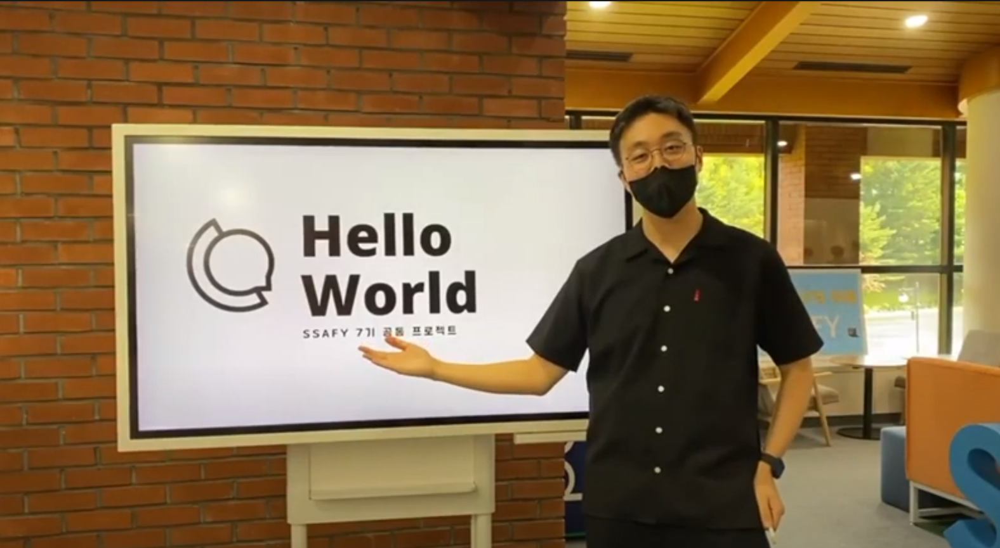

---

### 랜딩 페이지

프로젝트 링크 접속 시 가장 먼저 나오는 페이지입니다.

### 회원가입

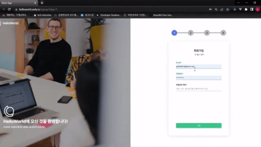

올바른 이메일과 비밀번호 등의 회원 정보를 입력합니다.

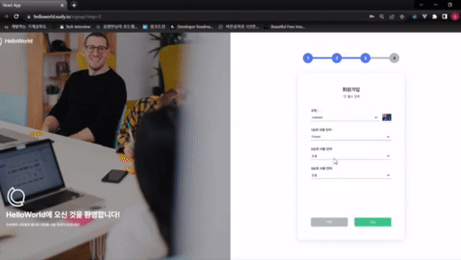

국적, 언어, 프로필 이미지를 설정하고 개인정보 처리방침에 동의하면 회원가입이 완료됩니다.

### 포스트

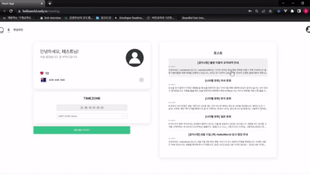

공지사항, 나라별 문화 등의 내용이 등록된 포스트를 볼 수 있습니다.

### 매칭 & 미팅

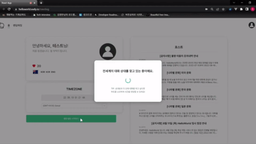

매칭을 시작했을 때 로딩 화면 & 매칭 성공 5초 후 미팅 페이지로 이동합니다

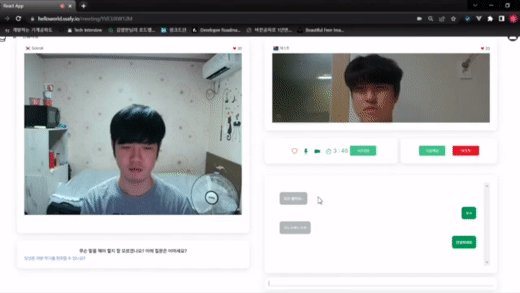

마이크 & 카메라 ON/OFF & 채팅 기능 테스트

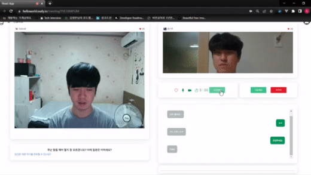

하트 보내기 기능

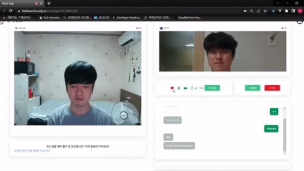

좌하단에 제공되는 질문 예시 텍스트