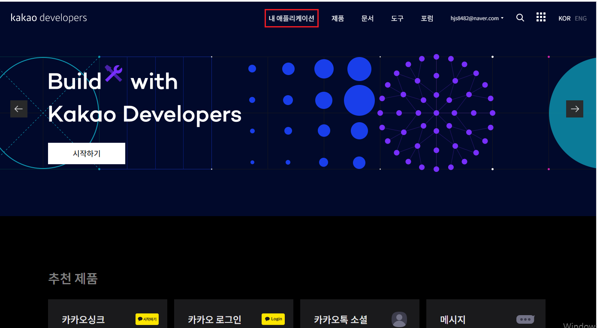

# oauth

## Kakao OAuth

- 카카오 디벨로퍼 사이트 접속 ([https://developers.kakao.com/](https://developers.kakao.com/))
- 내 어플리케이션 → 어플리케이션 추가하기

- rest api키로 client-id 값에 사용

- 카카오 로그인 활성화 & redirect uri 등록

- 사용자로부터 받아올 정보 동의 설정

- 보안 탭에서 secret 생성한 뒤 client-secret값으로 사용

- 허용 IP주소에 서버 돌리는 컴퓨터의 공인 IP주소 등록

## Naver OAuth

- 네이버 디벨로퍼 사이트 접속 ([https://developers.naver.com/main/](https://developers.naver.com/main/))
- Application - 어플리케이션 등록하기

- 사용 api를 네이버 로그인으로 설정 후 접근 권한 세팅

- 서비스 할 도메인과 redirect uri 설정

- 개발 설정 파일에서 client_id 와 secret으로 사용

## Google OAuth

- 구글 클라우드 콘솔에 접속 ([https://console.cloud.google.com/](https://console.cloud.google.com/))
- 상단의 프로젝트 클릭한 뒤 new project

- Oauth consent screen에서 external 선택 후 create

- app name, user suppory email, developer contact 정보 기입 후 다음 단계

- 유저 정보 권한 설정 후 쭉 다음 단계

- oauth client id credentials 생성

- web-application 설정
- web name과 redirect-uri 설정

- 부여받은 client_id, secret 개발 설정 파일에 적용

