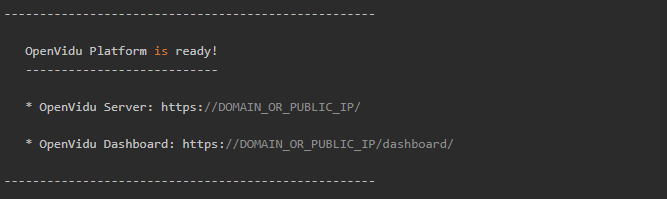
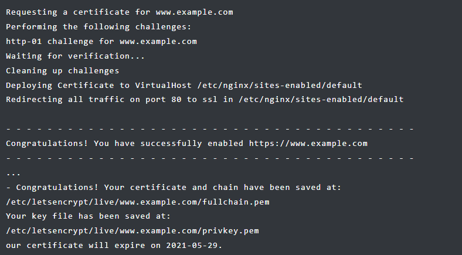
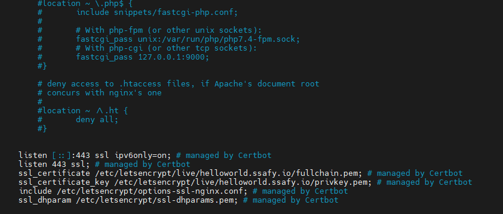

# 배포

## Docker

- 이전 버전 제거
    
    ```bash
    sudo apt-get remove docker docker-engine docker.io containerd runc
    ```
    
- allow apt to use a repository over HTTPS
    
    ```bash
    sudo apt-get update
    sudo apt-get install \
        ca-certificates \
        curl \
        gnupg \
        lsb-release
    ```
    
- GPG key 설정
    
    ```bash
    sudo mkdir -p /etc/apt/keyrings
    curl -fsSL https://download.docker.com/linux/ubuntu/gpg | sudo gpg --dearmor -o /etc/apt/keyrings/docker.gpg|
    ```
    
- 레포지토리 셋업
    
    ```bash
    echo \
      "deb [arch=$(dpkg --print-architecture) signed-by=/etc/apt/keyrings/docker.gpg] https://download.docker.com/linux/ubuntu \
      $(lsb_release -cs) stable" | sudo tee /etc/apt/sources.list.d/docker.list > /dev/null
    ```
    
- 도커 설치
    
    ```bash
    sudo apt-get update
    sudo apt-get install docker-ce docker-ce-cli containerd.io docker-compose-plugin
    ```
    

## 오픈비두

- 사용할 포트 확인
    
    > 80, 443, 3478, 5442, 5443, 8888
    > 
    - 실행중인 프로세스 확인
    
    ```bash
    ps -ef | grep <name>
    ```
    
    - 사용 중인 포트 번호 확인
    
    ```bash
    sudo apt-get update
    sudo apt-get install net-tools
    
    sudo netstat -ntlp
    ```
    
    - 프로세스 제거
    
    ```bash
    sudo kill -9 <PID>
    ```
    
- 방화벽 허용
    
    ```bash
    sudo apt-get update
    sudo apt-get install ufw
    
    sudo ufw allow ssl
    sudo ufw allow http
    sudo ufw allow https
    sudo ufw allow 3478/udp
    sudo ufw allow 3478/tcp
    sudo ufw allow 40000:57000/udp
    sudo ufw allow 40000:57000/tcp
    sudo ufw allow 57001:65535/udp
    sudo ufw allow 57001:65535/tcp
    sudo ufw allow enable
    ```
    

- docker와 docker-compose 설치 확인
- root권한으로 openvidu 설치

```bash
cd /opt
sudo su
curl https://s3-eu-west-1.amazonaws.com/aws.openvidu.io/install_openvidu_latest.sh | bash
```

- .env 파일로 환경 세팅

```bash
cd /openvidu
vi .env
```

```bash
# OpenVidu configuration
# ----------------------
DOMAIN_OR_PUBLIC_IP=

OPENVIDU_SECRET=
# Certificate type:
# - selfsigned:  Self signed certificate. Not recommended for production use.
#                Users will see an ERROR when connected to web page.
# - owncert:     Valid certificate purchased in a Internet services company.
#                Please put the certificates files inside folder ./owncert
#                with names certificate.key and certificate.cert
# - letsencrypt: Generate a new certificate using letsencrypt. Please set the
#                required contact email for Let's Encrypt in LETSENCRYPT_EMAIL
#                variable.
CERTIFICATE_TYPE= 
LETSENCRYPT_EMAIL=
...

HTTP_PORT=80
HTTPS_PORT=443
```

- 오픈비두 실행

```bash
./openvidu start
```



<aside>
💡 letsencrypt certification 위해 http : 80, https 443 포트로 최초 실행

</aside>

## Nginx

- nginx 설치

```bash
sudo apt-get update
sudo apt-get install nginx
```

- https 통신을 위해 ssl/tls 설정

```bash
sudo snap install core
sudo snap refresh core
sudo snap install --classic certbot

sudo ln -s /snap/bin/certbot /usr/bin/certbot
sudo certbot --nginx
```



<aside>
💡 certbot을 통한 무료 letsencrypt는 한 도메인당 1주일에 최대 5회만 받을 수 있음

</aside>

```bash
vi /etc/nginx/sites-available/default
pem key 확인
```



```bash
sudo service nginx start
```

## 백엔드

- 빌드한 jar 파일 실행
    
    ```bash
    java -jar <file_name>.jar
    
    -back-ground 실행
    nohup java -jar <file_name>.jar
    ```
    
- nginx 설정
    
    ```bash
    sudo vi /etc/nginx/sites-available/default
    
    server {
    	...
    	server_name example.com;
    	location /api {
    			proxy_pass http://localhost:8080/api;
    	}
    	...
    }
    ```
    
    ```bash
    sudo nginx -t
    sudo service nginx restart
    ```
    

## 프론트엔드

- nginx 설정
    
    ```bash
    sudo vi /etc/nginx/sites-available/default
    
    server {
    	...
    	server_name example.com;
    	location / {
    			proxy_pass http://localhost:3000;
    	}
    
    	location /api {
    			proxy_pass http://localhost:8080/api;
    	}
    	...
    }
    ```
    
    ```bash
    sudo nginx -t
    sudo service nginx restart
    ```
    
- Dockerfile
    
    ```bash
    프로젝트 최상단에 Dockerfile 만들기
    vi Dockerfile
    ```
    
    ```bash
    FROM nginx
    
    RUN mkdir /app
    
    WORKDIR /app
    
    RUN mkdir ./build
    
    ADD ./build ./build
    
    RUN rm /etc/nginx/conf.d/default.conf
    
    COPY ./nginx.conf /etc/nginx/conf.d
    
    EXPOSE 80
    
    CMD ["nginx", "-g", "daemon off;"]
    ```
    
- nginx.conf 파일 추가 제작
    
    ```bash
    Dockerfile있는곳에 nginx.conf 만들기
    
    vi nginx.config
    ```
    
    ```bash
    server {
    	listen 80;
    	server_name example.com;
    	
    	location / {
    		root /app/build;
    		index index.html;
    		try_files $uri $uri/ /index.html;
    	}
    }
    ```
    
- 빌드 프로젝트
    
    ```bash
    npm install
    npm run build
    ```
    
- 도커 이미지화 & 실행
    
    ```bash
    sudo docker login
    sudo docker build -t <도커 아이디>/<이미지명>:<버전>
    sudo docker push <도커 아이디>/<이미지명>:<버전>
    
    sudo docker pull <도커 아이디>/<이미지명>:<버전>
    sudo docker run -d --name <name> -p 3000:80 <도커 아이디>/<이미지명>:<버전>
    ```
    
    <aside>
    💡 푸쉬 전 docker hub에 가서 레포지토리를 이미지 명과 동일하게 만들어 줘야 함
    
    </aside>
    

## DB with Docker

- Mysql 설치 & 실행
    
    ```bash
    sudo docker pull mysql:latest
    sudo docker run -d --name <name> -e MYSQL_ROOT_PASSWORD=<password> -p 3306:3306 mysql:latest
    ```
    
- Mysql db 생성
    
    ```bash
    sudo docker exec -it <name> /bin/bash
    
    mysql -u root -p
    
    create database IF NOT EXISTS `db_name` collate utf8mb4_general_ci;
    ```
    
- Mysql User 생성 & 권한 부여
    
    ```bash
    create user '사용자계정'@'localhost' identified by '비밀번호';
    grant all privileges on <db_name>.* to '사용자계정'@'localhost';
    flush privileges;
    ```
    
    <aside>
    💡 [localhost](http://localhost) 대신 %사용하여 외부에서 접근 허용
    
    </aside>
    

- Redis 설치 & 실행
    
    ```bash
    sudo docker pull redis
    docker run -d --name <name> -p 6378:6378 redis
    ```