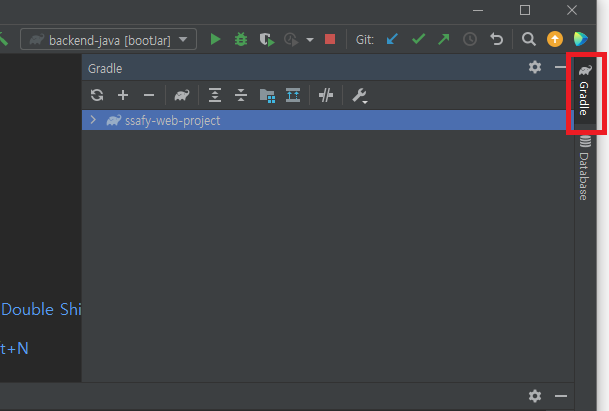
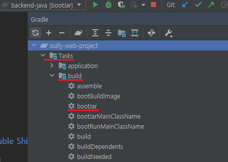
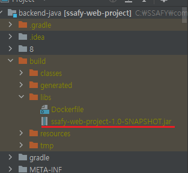

# 빌드

## **Back-end**

### [application-secret.properties](http://application-secret.properties) 작성

```java
#datasource
spring.datasource.url=jdbc:mysql://${domain_address}/${database_name}?useUnicode=true&characterEncoding=utf8&serverTimezone=Asia/Seoul&zeroDateTimeBehavior=convertToNull&rewriteBatchedStatements=true
spring.datasource.driver-class-name=com.mysql.cj.jdbc.Driver
spring.datasource.hikari.username=${username}
spring.datasource.hikari.password=${password}

# jwt
jwt.secret=${jwt.secret}
# unit is ms. 15 * 24 * 60 * 60 * 1000 = 15days
jwt.expiration=1296000000

```

### [application-oauth2.properties](http://application-oauth2.properties) 작성

```java
# Provider
## naver
spring.security.oauth2.client.provider.naver.authorization-uri=https://nid.naver.com/oauth2.0/authorize
spring.security.oauth2.client.provider.naver.token-uri=https://nid.naver.com/oauth2.0/token
spring.security.oauth2.client.provider.naver.user-info-uri=https://openapi.naver.com/v1/nid/me
spring.security.oauth2.client.provider.naver.user-name-attribute=response

## kakao
spring.security.oauth2.client.provider.kakao.authorization-uri=https://kauth.kakao.com/oauth/authorize
spring.security.oauth2.client.provider.kakao.token-uri=https://kauth.kakao.com/oauth/token
spring.security.oauth2.client.provider.kakao.user-info-uri=https://kapi.kakao.com/v2/user/me
spring.security.oauth2.client.provider.kakao.user-name-attribute=id

# registration
## GOOGLE
spring.security.oauth2.client.registration.google.client-id= ${google.client.id}
spring.security.oauth2.client.registration.google.client-secret= ${google.client.secter}
spring.security.oauth2.client.registration.google.scope=https://www.googleapis.com/auth/userinfo.email,https://www.googleapis.com/auth/userinfo.profile

## KAKAO
spring.security.oauth2.client.registration.kakao.client-id= ${kakao.client.id}
spring.security.oauth2.client.registration.kakao.client-secret= ${kakao.client.secret}
spring.security.oauth2.client.registration.kakao.scope= profile_nickname,account_email,gender,age_range,birthday
spring.security.oauth2.client.registration.kakao.authorization-grant-type=authorization_code
spring.security.oauth2.client.registration.kakao.client-authentication-method=POST
spring.security.oauth2.client.registration.kakao.client-name=Kakao

## NAVER
spring.security.oauth2.client.registration.naver.client-id= ${naver.client.id}
spring.security.oauth2.client.registration.naver.client-secret= ${naver.client.secret}
spring.security.oauth2.client.registration.naver.authorization-grant-type=authorization_code
spring.security.oauth2.client.registration.naver.scope= profile_nickname,account_email,gender,age_range,birthday
spring.security.oauth2.client.registration.naver.client-name=Naver
spring.oauth2.naver.state= ${naver.state}

## call-back uri
spring.security.oauth2.client.registration.google.redirect-uri=http://localhost:8080/api/v1/auth/oauth2/google/callback
spring.security.oauth2.client.registration.kakao.redirect-uri=http://localhost:8080/api/v1/auth/oauth2/kakao/callback
spring.security.oauth2.client.registration.naver.redirect-uri=http://localhost:8080/api/v1/auth/oauth2/naver/callback

```

```java
Intellij 기준으로 오른쪽 네비 바의 gradle 항목 클릭
```



```java
Task -> build -> bootjar 더블클릭하여 빌드 실행
```



```java
 jar파일이 프로젝트의 build/libs에 생성됨 확인
```



## Feont-end

```bash
npm install --legacy-peer-deps
npm run build
```